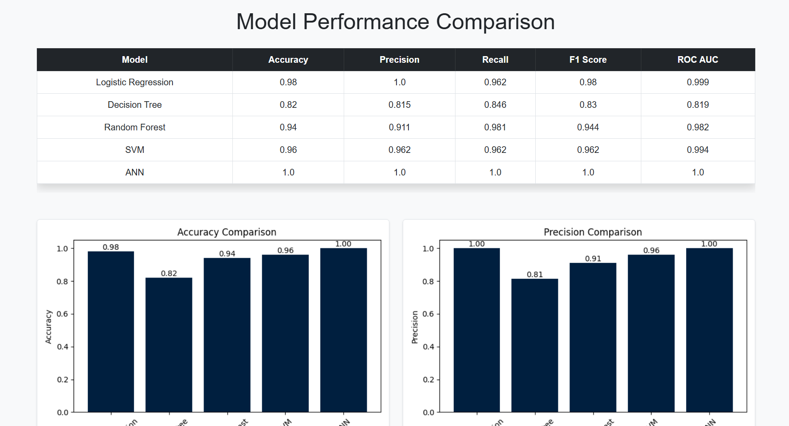
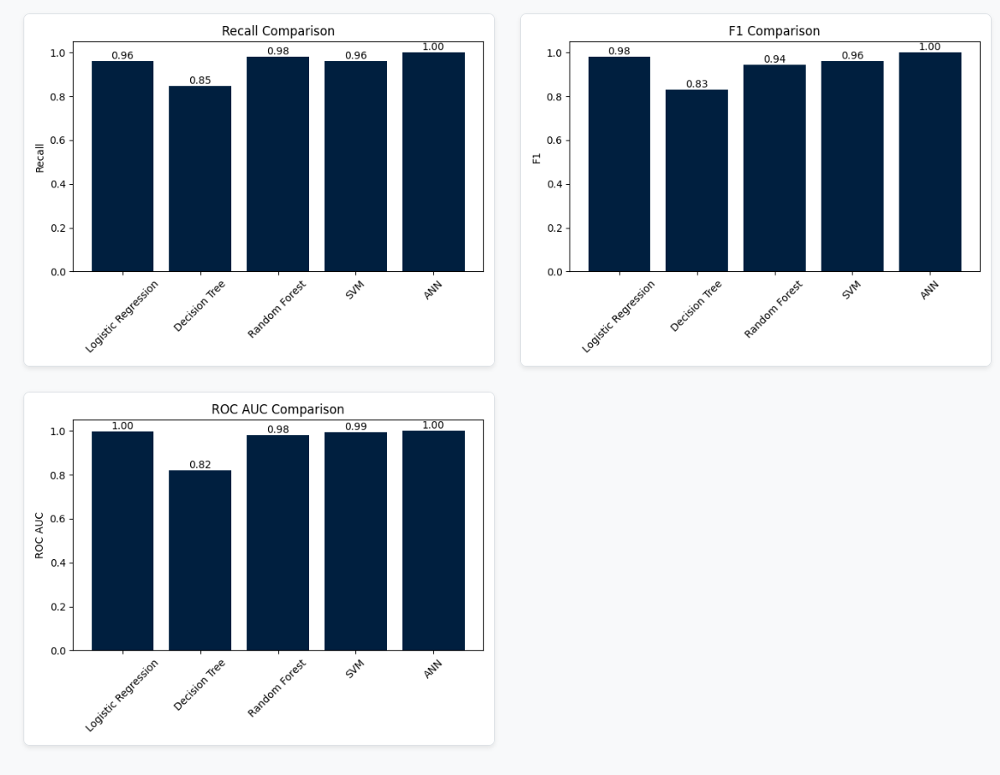

# 🚗 Car Price Prediction

A machine learning web application that predicts whether a person will purchase a car based on their annual salary. Built using Python, Flask, and a trained Artificial Neural Network (ANN) model.




## 🔗 Live Demo

👉 [view live](https://car-price-prediction-2-g1ys.onrender.com/)

---

## 📌 Features

- 📊 Predicts car purchasing decisions using salary as input.
- 🧠 Uses a trained ANN model for accurate predictions.
- 💻 Simple, clean UI using HTML, CSS, and Bootstrap.
- ⚙️ Powered by Flask and deployed for public use.

---

## 🛠️ Tech Stack

- **Frontend:** HTML, CSS, Bootstrap
- **Backend:** Python, Flask
- **Machine Learning:** ANN (Artificial Neural Network)
- **Deployment:** Render / Railway / Heroku *(replace with your platform)*

---

## 🗂️ Project Structure


---

## 🚀 Getting Started

Clone this repo and run it locally:

```bash
git clone https://github.com/Prakhar17m/Car-price-prediction.git
cd Car-price-prediction
pip install -r requirements.txt
python app.py
